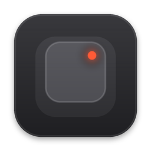

<p align="center">
  
</p>

<h1 align="center">Ten-Four</h1>

<p align="center"><strong>Talk to your computer. Your words land wherever your cursor is.</strong></p>

Ten-Four is a free speech-to-text app for Mac.
Hold a shortcut, speak, let go, and the text is typed into whatever app you're using: your AI agent, your email, your notes.
The name is radio slang for "message received".

Ten-Four is a fork of [Handy](https://github.com/cjpais/Handy) by [CJ Pais](https://github.com/cjpais).
Handy does the hard part: local speech recognition, recording, shortcuts and the desktop app itself.
Ten-Four adds a layer of writing tools and a new interface on top.
If you want the original, cross-platform app, use [Handy](https://handy.computer) and consider [supporting it](https://handy.computer/donate).

## What Ten-Four adds

- **Smart Format** tidies spoken rambling into clean sentences before it is pasted.
- **App Styles** adapt Smart Format to the app you're dictating into, so a chat message reads casually and an email reads properly.
- **Snippets** expand a short spoken phrase into text you type often.
- **Spoken line breaks** let you say "new line" or "new paragraph".
- **The recording island** sits in the Mac's notch and shows your words live while you speak.
- **A new identity**: the Tally Light design system, the pocket-recorder icon and start and stop sounds.
- **Fixes** for pasting the right text and for timing quick shortcut taps.

## Privacy

Speech is transcribed on your Mac, as in Handy.
Smart Format and App Styles are the exception: when you turn them on, the transcribed text and a short style hint (never the audio) are sent to the language model provider you choose, such as Groq, OpenAI or Anthropic, using your own API key.
Leave them off and Ten-Four works fully offline.

## Install

Ten-Four currently runs on Apple Silicon Macs.

1. Download the latest `Ten-Four` build from [Releases](../../releases).
2. Move `Ten-Four.app` to your Applications folder.
3. Open it. Ten-Four is not notarised by Apple yet, so macOS will block the first launch.
   Go to **System Settings > Privacy & Security**, scroll down and choose **Open Anyway**.
4. Grant **Microphone** and **Accessibility** access when asked.
5. Pick a speech model in the setup screen.
6. Hold **Option + Space**, speak, and let go.

Ten-Four does not update itself.
Check [Releases](../../releases) for new versions.

## Build from source

Ten-Four builds the same way as Handy: see [BUILD.md](BUILD.md).

```bash
bun install
bun run tauri dev
```

Handy's [README](https://github.com/cjpais/Handy#readme) covers models, CLI flags and troubleshooting, and nearly all of it applies to Ten-Four too.

## Reporting problems

Please report Ten-Four issues here, not on the Handy repository.
Handy's maintainers don't support this fork.

## Credits

- [Handy](https://github.com/cjpais/Handy) by CJ Pais and its contributors, the foundation Ten-Four is built on.
- [Whisper](https://github.com/openai/whisper) by OpenAI, [ggml](https://github.com/ggml-org/ggml), [Silero VAD](https://github.com/snakers4/silero-vad) and [Tauri](https://tauri.app), which Handy builds on.

Ten-Four is not affiliated with or endorsed by Handy or CJ Pais.
The Handy name, logo and brand assets belong to the Handy project and are not used here.

## License

MIT, see [LICENSE](LICENSE).
Handy's original code is copyright CJ Pais.
Ten-Four's changes are copyright Kudakwashe Mutasa.
